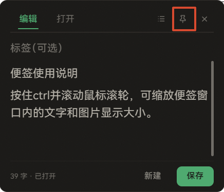
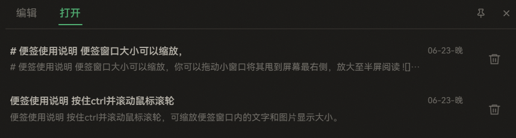
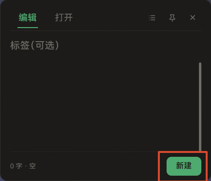
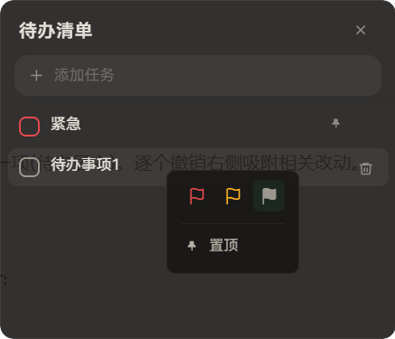

# 便签使用说明

便签窗口大小可以缩放，建议拖动小窗口将其甩到屏幕最右侧，放大至半屏阅读说明

缩放：按住ctrl+鼠标滚轮，可以缩放窗口内的文本和图片显示大小

便签支持基本markdown语法和粘贴图片功能

 

# 1.便签

## 1.1 ctrl+space是本便签的常用快捷键

（1）便签在托盘时，按下`ctrl+space`呼出编辑窗口

右上角图标为转为磁贴模式，磁贴模式下不可编辑，只可以缩放显示大小。

（2）当便签已在桌面显示时，如果你正在使用其他软件（如微信聊天窗口），按下`ctrl+space`会切回便签，并把光标定位到编辑区，方便你直接输入内容。

（3）在磁贴模式下，按下`ctrl+space`可以转回编辑器，也可以按右键-转为小窗

## 1.2 编辑的便签内容会自动保存在历史便签中，并记录最后修改时间

内容改动时，编辑器默认1s后自动保存

## 历史便签（md文件）保存在软件安装目录下的note文件夹内，可以用其它md编辑器打开

## 1.3 右下角-新建空白便签

 

# 2.待办清单

通过右上角图标可以呼出待办清单窗口

待办清单在屏幕顶部边缘时，鼠标离开窗口会收缩，变成类似灵动岛的状态栏

右键待办条目可以设置事件优先级或置顶事件

小状态栏会根据未完成待办事项变化，显示事件优先级和待办事件数目

